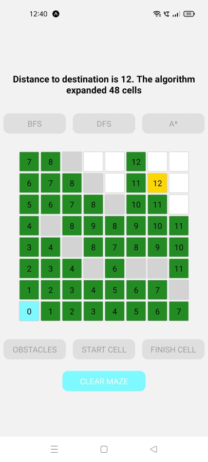
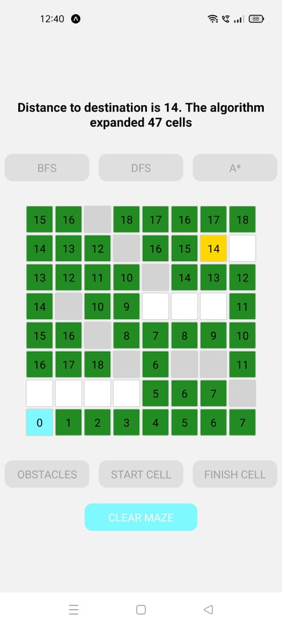
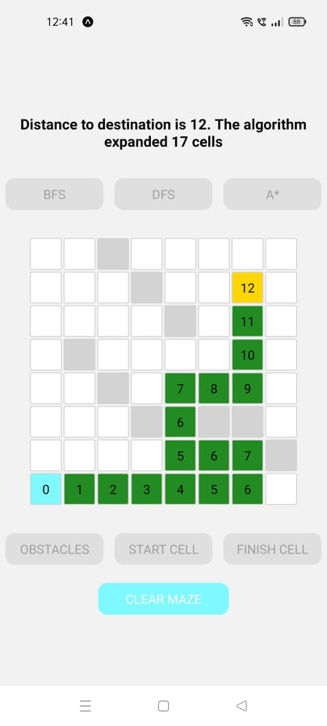
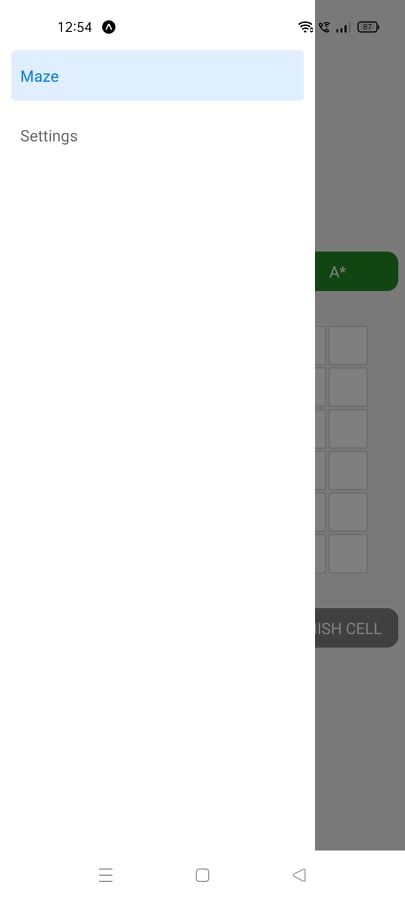
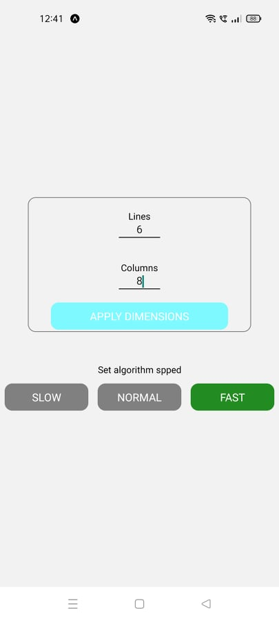

# algorithm-maze
Pathfinding Algorithms Visualizer for mobile built with React Native.

## Functionality
You can visualize common pathfinding algorithms on a rectangular interactive matrix. You can set your start and end cell and you can add obstacles which the algorithm has to avoid.
 
 
You can choose between 3 pathfinding algorithms: Breadth-First-Search (BFS), Depth-First-Search (DFS) or A* (A*, with Manhattan distance heuristic).
 
 
After the algorithm runs, you are given a summary with the distance to the destination, the number of cells that the algorithm expaneded, and a Clear Maze option that you can use to run another algorithm on the same matrix setup and compare their results, as shown below.
 

  
  
  

 

## State Management & Further Customization
This app uses Redux and React-Redux to manage the state of the matrix (the dimensions, which cells are obstacles or not, path cells and their distance from the source).
 
 
To further customize your experience, you can swipe right on the screen to acces the Drawer Navigator and go to the Settings Screen. There you may change the number of lines and columns of the maze, or change the animation speed for the visualizer (SLOW - 300 miliseconds per expanded cell, NORMAL - 150 ms, FAST - 10ms).
 

  
  

